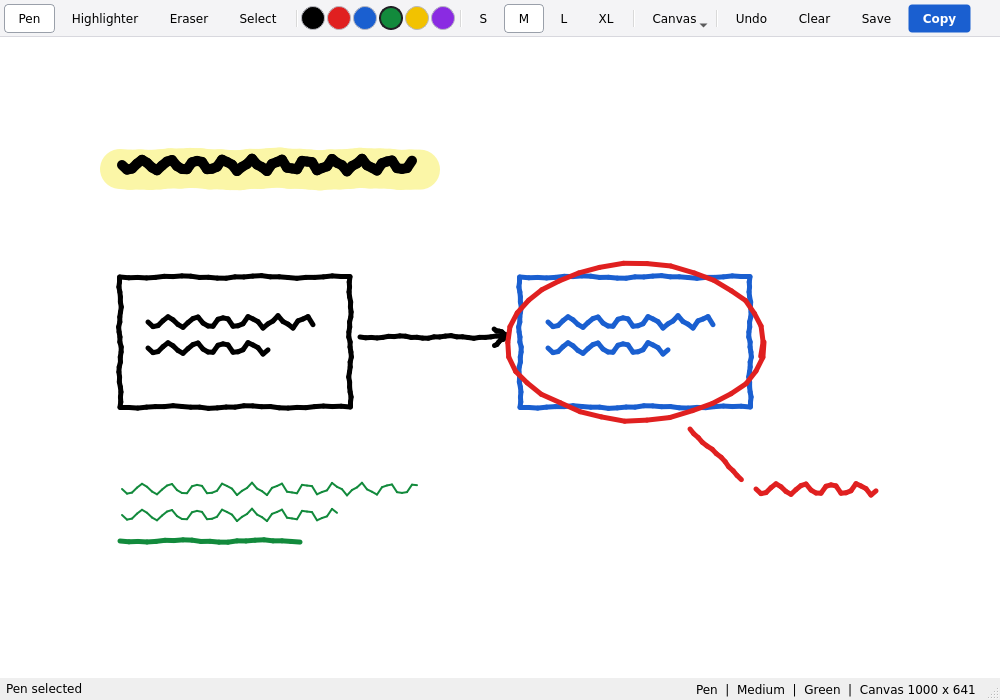
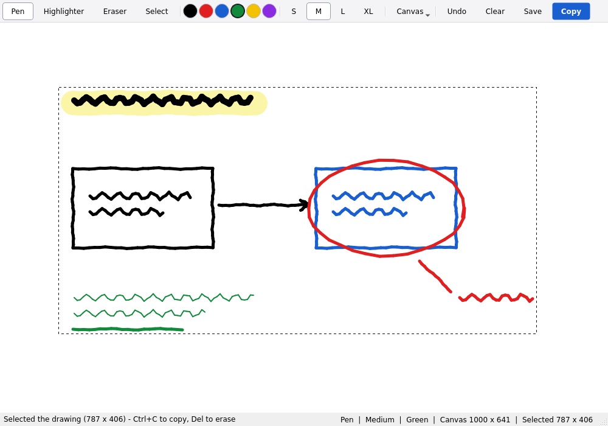

<div align="center">

<picture>
  <source media="(prefers-color-scheme: dark)" srcset="docs/logo-dark.svg">
  
</picture>


### A fast scratchpad drawing app for Linux

Sketch something, press <kbd>Ctrl</kbd>+<kbd>C</kbd>, paste it anywhere.<br>
No accounts, no files to manage, no Electron — just Python and Qt.


<br><br>



<br><br>

<a href="https://buymeacoffee.com/tekniq">
  
</a>

</div>

---

## Install

**Arch Linux** — one command for the dependencies, one to install InkClip:

```bash
sudo pacman -S python pyside6 qt6-wayland
```

```bash
git clone https://github.com/HaxNet/InkClip.git
cd InkClip
make user-install
```

That is it. **InkClip** now appears in rofi, wofi, and your app menu — search for
`inkclip`, or any of *draw*, *sketch*, *scratchpad*, *clipboard*.

> [!NOTE]
> The Arch package is `pyside6`, in the `extra` repo. It used to be published as
> `python-pyside6`; that name no longer resolves, so an older `pacman -S
> python-pyside6` command will fail with *target not found*.

`make user-install` is per-user and needs no root. It installs into `~/.local`:

| Path | What |
| :--- | :--- |
| `~/.local/bin/inkclip` | launcher command |
| `~/.local/share/inkclip/main.py` | the app |
| `~/.local/share/applications/inkclip.desktop` | the launcher entry |
| `~/.local/share/icons/hicolor/scalable/apps/inkclip.svg` | the icon |

<details>
<summary><b>Other ways to install</b> — system-wide, as a pacman package, or in a virtualenv</summary>

<br>

**System-wide**

```bash
sudo make install              # into /usr/local
sudo make install PREFIX=/usr  # into /usr
```

**As a real pacman package**

A `PKGBUILD` is included, so pacman owns the files and removes them cleanly:

```bash
makepkg -si                        # build and install from this checkout
pacman -Qo $(command -v inkclip)   # confirm pacman owns it
sudo pacman -R inkclip             # uninstall
```

`yay -U inkclip-*.pkg.tar.zst` installs the built package through your AUR helper.
The `PKGBUILD` has a commented-out block showing what to change to publish it on
the AUR from a tagged release tarball.

**In a virtualenv**, without touching system packages:

```bash
python -m venv .venv
source .venv/bin/activate
pip install -r requirements.txt
python main.py
```

</details>

<details>
<summary><b>Uninstall</b></summary>

<br>

```bash
make user-uninstall     # removes the ~/.local install
sudo make uninstall     # removes the /usr/local install
sudo pacman -R inkclip  # if installed as a package
```

</details>

## Run

Pick **InkClip** out of rofi, or from a terminal:

```bash
inkclip          # once installed
python main.py   # straight from a checkout (or: make run)
```

## Features

| | |
| :--- | :--- |
| **Pen, highlighter, eraser** | Round caps, antialiased, six colors and four brush sizes |
| **Copy to clipboard** | <kbd>Ctrl</kbd>+<kbd>C</kbd> puts the canvas straight on the system clipboard |
| **Trim to the drawing** | <kbd>Ctrl</kbd>+<kbd>A</kbd> selects only what you drew, not the blank canvas |
| **Rectangular select** | Copy, save, or delete just one region |
| **Canvas sizes** | Fit to window, or a fixed 800x600 / 1280x720 / 1920x1080 / custom canvas |
| **Undo** | 30 steps of strokes, clears and deletions — and it survives canvas resizes |
| **Save PNG** | <kbd>Ctrl</kbd>+<kbd>S</kbd> with a normal file dialog |
| **Stylus support** | Pressure-sensitive pen strokes wherever Qt reports them |

## Copying just the drawing

<kbd>Ctrl</kbd>+<kbd>A</kbd> selects **the drawing**, not the canvas. InkClip finds
the bounding box of every non-white pixel and selects that, so
<kbd>Ctrl</kbd>+<kbd>C</kbd> gives you a tightly cropped image instead of your
sketch adrift in a sea of white.

<div align="center">

</div>

```text
draw something  ->  Ctrl+A  ->  Ctrl+C  ->  paste
```

It keeps whatever tool you were holding, so you can carry on drawing and hit
<kbd>Ctrl</kbd>+<kbd>A</kbd> again for an updated crop. Erasing shrinks the box back
down, and on a blank canvas it says so rather than selecting nothing.
<kbd>Ctrl</kbd>+<kbd>Shift</kbd>+<kbd>A</kbd> selects the whole canvas if you do
want the full frame.

## Selecting, deleting, resizing

**Select a region** with the **Select** tool (<kbd>S</kbd>) and a drag. Copy and
Save PNG then act on that region instead of the whole canvas.

- <kbd>Del</kbd> / <kbd>Backspace</kbd> erases the selected region, leaving the rest
  of the drawing untouched — and it is undoable
- <kbd>Esc</kbd>, or a single click with the select tool, dismisses the marquee
  without changing the drawing
- Deleting a region drops the marquee with it, so a later
  <kbd>Ctrl</kbd>+<kbd>C</kbd> cannot silently copy an emptied region
- The status bar always shows the active selection, so you never copy a stale one

**Resize the canvas** from the **Canvas** toolbar menu:

| Choice | Behaviour |
| :--- | :--- |
| Fit to window | Fills the window and grows as you resize it (the default) |
| 800x600, 1280x720, 1920x1080 | A fixed canvas of exactly that many pixels |
| Custom... | Anything from 64x64 to 8192x8192 |

A fixed canvas is centred in the window and scrolls if it is larger. Its size is
exact — a 1920x1080 canvas copies and saves as a 1920x1080 image. Changing size
keeps what you have drawn, and undo keeps working across the change.

## Keyboard shortcuts

| Shortcut | Action |
| :--- | :--- |
| <kbd>Ctrl</kbd>+<kbd>C</kbd> | Copy canvas (or selection) to clipboard |
| <kbd>Ctrl</kbd>+<kbd>A</kbd> | Select just the drawing, trimming blank margins |
| <kbd>Ctrl</kbd>+<kbd>Shift</kbd>+<kbd>A</kbd> | Select the whole canvas |
| <kbd>Del</kbd> / <kbd>Backspace</kbd> | Erase the selected region |
| <kbd>Esc</kbd> | Dismiss the selection |
| <kbd>Ctrl</kbd>+<kbd>Z</kbd> | Undo |
| <kbd>Ctrl</kbd>+<kbd>S</kbd> | Save canvas (or selection) as PNG |
| <kbd>P</kbd> / <kbd>H</kbd> / <kbd>E</kbd> / <kbd>S</kbd> | Pen / highlighter / eraser / select |
| <kbd>1</kbd> <kbd>2</kbd> <kbd>3</kbd> <kbd>4</kbd> | Brush size: small, medium, large, extra large |
| <kbd>C</kbd> | Clear the whole canvas |

Plain <kbd>C</kbd> clears and <kbd>Ctrl</kbd>+<kbd>C</kbd> copies — Qt matches
modifiers exactly, so the two never collide.

## Development

```text
InkClip/
├── main.py                    # the whole app
├── Makefile                   # install / uninstall targets
├── PKGBUILD                   # Arch package definition
├── packaging/
│   ├── inkclip.desktop.in     # launcher entry (@BINDIR@ filled in at install)
│   └── inkclip.svg            # scalable app icon
├── docs/                      # logo and screenshots
├── requirements.txt
├── LICENSE
└── README.md
```

The app is one file with three classes: `DrawingCanvas(QWidget)` owns the `QImage`
that strokes are painted onto, `MainWindow(QMainWindow)` owns the toolbar, status
bar and shortcuts, and `CanvasSizeDialog(QDialog)` is the two spin boxes behind
**Canvas > Custom...**.

Things worth knowing before changing it:

- **Highlighter strokes go on an overlay.** Painting translucent segments straight
  onto the canvas would stack alpha wherever a stroke crosses itself, leaving dark
  blobs at every curve. The in-progress stroke is collected opaque on a transparent
  layer and composited once at 35% on release.
- **The eraser is just a white pen**, which is why the canvas is always opaque white
  rather than transparent.
- **Backing images are allocated at widget size times device pixel ratio**, so
  strokes stay crisp on HiDPI. A *fixed* canvas is the exception: it is defined in
  output pixels and stays at a ratio of 1.0, because "1920x1080" has to mean
  1920x1080 in the clipboard. See `DrawingCanvas._image_dpr`.
- **`content_rect` scans the raw image buffer**, not `pixel()` calls. A white pixel
  is always four `0xff` bytes, so an untouched row compares equal to a run of
  `0xff`, and stripping that run off each end of a row gives the first and last
  touched pixel. A full 1920x1080 canvas scans in about 6 ms, a blank one under 1 ms.
- **A drag builds its rectangle from its own width and height**, never
  `QRect(topLeft, bottomRight)`, whose inclusive corners would make a 300px drag
  select 301px.
- **Undo stores whole image copies** (capped at 30 by `UNDO_LIMIT`) and refits them
  if the canvas was resized in between. Simple, and plenty fast for a scratchpad.
- `app.setDesktopFileName("inkclip")` links the window to `inkclip.desktop`, which
  is what lets compositors and bars (niri, waybar, ...) show the right name and icon.
- The `.desktop` entry is generated from `packaging/inkclip.desktop.in` at install
  time with an absolute `Exec=` path, so rofi can launch it even when
  `~/.local/bin` is not on the launcher's `PATH`. `make check` validates it.

Tunables sit at the top of `main.py`: `BRUSH_SIZES`, `PALETTE`,
`HIGHLIGHTER_OPACITY`, `HIGHLIGHTER_WIDTH_FACTOR`, `ERASER_WIDTH_FACTOR`,
`CONTENT_MARGIN`, `CANVAS_PRESETS`, `UNDO_LIMIT`.

## Troubleshooting

<details>
<summary><b>Nothing pastes after Ctrl+C</b></summary>

<br>

On X11 and Wayland the clipboard is owned by the running application. If you close
InkClip before pasting, the image is gone. Keep it open until you have pasted, or
run a clipboard manager (`clipman`, `copyq`, `parcellite`) that keeps history.

A few apps only accept `text/uri-list` or a file drop rather than raw image data.
Use **Save PNG** and attach the file instead.

</details>

<details>
<summary><b>Wayland: the paste target sees nothing at all</b></summary>

<br>

Make sure the Qt Wayland platform plugin is installed:

```bash
sudo pacman -S qt6-wayland
```

If one specific app still misbehaves, try forcing X11/XWayland for InkClip:

```bash
QT_QPA_PLATFORM=xcb inkclip
```

</details>

<details>
<summary><b>InkClip does not show up in rofi</b></summary>

<br>

Check the entry landed and is valid:

```bash
ls ~/.local/share/applications/inkclip.desktop
desktop-file-validate ~/.local/share/applications/inkclip.desktop
```

If it is there but rofi still misses it, you have the desktop cache enabled
(`drun-use-desktop-cache: true` in `~/.config/rofi/config.rasi`) — drop that line,
or refresh with `rofi -show drun -drun-reload-desktop-cache`.

</details>

<details>
<summary><b>The rofi entry has no icon</b></summary>

<br>

rofi hides icons unless asked. Run `rofi -show drun -show-icons`, or add
`show-icons: true;` to the `configuration { ... }` block in
`~/.config/rofi/config.rasi`.

</details>

<details>
<summary><b>ModuleNotFoundError: No module named 'PySide6'</b></summary>

<br>

Install it with `sudo pacman -S pyside6`, or activate your virtualenv and run
`pip install -r requirements.txt`.

</details>

<details>
<summary><b>Stylus input does nothing</b></summary>

<br>

Qt needs tablet support from the platform plugin. On X11 make sure
`xf86-input-wacom` is installed; on Wayland the compositor handles it natively.
Mouse drawing always works regardless.

</details>

## Support

InkClip is free and always will be. If it saved you some time, you can say thanks:

<a href="https://buymeacoffee.com/tekniq">
  
</a>

Stars, bug reports and pull requests are just as welcome.

## License

[MIT](LICENSE) — do what you like with it, just keep the copyright notice.

# InkClip
